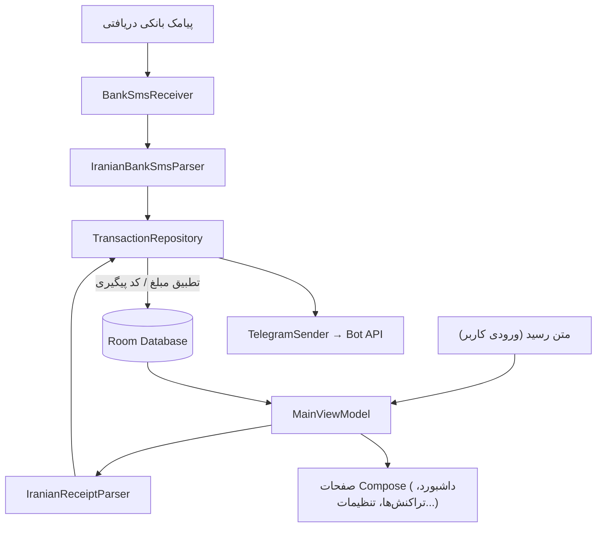

# ✅ Transaction Verifier | تأییدکننده تراکنش

اپلیکیشن اندرویدی **محلی (Local-first)** برای استخراج، تطبیق و تأیید خودکار تراکنش‌های بانکی ایرانی — از روی **پیامک بانک** و **متن رسید کارت‌به‌کارت** — همراه با گزارش لحظه‌ای وضعیت تراکنش به یک **ربات تلگرام** شخصی.

تمام پردازش و ذخیره‌سازی به‌صورت کاملاً محلی روی دستگاه انجام می‌شود؛ هیچ سرور یا بک‌اند ابری‌ای در کار نیست، و تنها ارتباط خروجی برنامه (در صورت فعال بودن) ارسال پیام به Bot API تلگرام است.

> این README پس از بررسی کامل کد منبع پروژه (تحلیل ساختار، منطق Parser ها، لایه دیتابیس، شبکه و صفحات UI) نوشته شده تا هم مستندی دقیق از وضعیت فعلی باشد و هم نقشه راه واقع‌بینانه‌ای برای تکمیل پروژه ارائه دهد.

---

## 📑 فهرست مطالب

- [درباره پروژه](#-درباره-پروژه)
- [ویژگی‌های پیاده‌سازی‌شده](#-ویژگیهای-پیادهسازیشده)
- [ویژگی‌های نیمه‌کاره یا نمایشی](#️-ویژگیهای-نیمهکاره-یا-نمایشی-شفافیت-فنی)
- [معماری](#-معماری)
- [پشته فناوری](#-پشته-فناوری)
- [ساختار پروژه](#-ساختار-پروژه)
- [پیش‌نیازها و راه‌اندازی](#-پیشنیازها-و-راهاندازی)
- [پیکربندی ربات تلگرام](#-پیکربندی-ربات-تلگرام)
- [اجرای تست‌ها](#-اجرای-تستها)
- [نقشه راه و گام‌های بعدی](#️-نقشه-راه-و-گامهای-بعدی)
- [مشارکت در توسعه](#-مشارکت-در-توسعه)
- [مجوز](#-مجوز)

---

## 📱 درباره پروژه

بسیاری از کاربران ایرانی که تراکنش‌های کارت‌به‌کارت زیادی دارند (فروشندگان، ادمین‌های فروش، افراد فعال در تلگرام/اینستاگرام)، نیاز دارند مطمئن شوند رسیدی که مشتری فرستاده واقعاً با پیامک بانکشان مطابقت دارد. **Transaction Verifier** این کار را خودکار می‌کند:

1. متن رسید کارت‌به‌کارت وارد می‌شود (کپی/پیست).
2. پیامک بانکی دریافتی به‌صورت خودکار توسط اپ خوانده و تجزیه می‌شود.
3. اگر مبلغ یا کد پیگیری این دو با هم مطابقت داشته باشد، تراکنش **تأیید‌شده (MATCHED)** علامت می‌خورد.
4. نتیجه (تأییدشده / در انتظار / ناموفق) بلافاصله به تلگرام کاربر ارسال می‌شود.

---

## ✨ ویژگی‌های پیاده‌سازی‌شده

| حوزه | توضیح |
|---|---|
| **تشخیص پیامک بانکی** | `BroadcastReceiver` روی `SMS_RECEIVED` گوش می‌دهد و با ترکیبی از کلیدواژه‌ها (واریز، برداشت، بانک، موجودی، مانده...) و پیش‌شماره فرستنده (۱۰۰۰/۲۰۰۰/۳۰۰۰/۶۰۰۰) پیامک بانکی را از پیامک‌های عادی جدا می‌کند. |
| **پارسر پیامک و رسید** | دو موتور Regex مجزا (`IranianBankSmsParser`, `IranianReceiptParser`) مبلغ، کد پیگیری، شماره کارت مبدأ/مقصد و نام بانک را استخراج می‌کنند. |
| **تشخیص بانک** | بیش از ۱۰ بانک ایرانی (ملی، ملت، سامان/بلو، تجارت، سپه، پاسارگاد، پارسیان، صادرات، کشاورزی، مسکن، رسالت، سینا، آینده) از روی متن یا ۶ رقم اول شماره کارت (BIN) شناسایی می‌شوند. |
| **نرمال‌سازی اعداد و ارز** | تبدیل خودکار ارقام فارسی/عربی به لاتین و تبدیل دوطرفه ریال ⇄ تومان. |
| **تطبیق خودکار** | `TransactionRepository` رسید و پیامک متناظر را بر اساس مبلغ یکسان یا کد پیگیری مشترک به هم متصل و وضعیت هر دو را به‌روزرسانی می‌کند. |
| **ذخیره‌سازی محلی** | پایگاه‌داده Room (SQLite) با یک جدول تراکنش شامل نوع، مبلغ، طرفین، وضعیت، متن خام رسید/پیامک و وضعیت ارسال تلگرام. |
| **اطلاع‌رسانی تلگرام** | ارسال پیام قالب‌بندی‌شده (HTML) به Bot API تلگرام برای هر تراکنش، دکمه «تست ارسال» و پیام‌های خطای کاربرپسند (مثلاً تشخیص نیاز به VPN هنگام قطعی اتصال به تلگرام). |
| **داشبورد آماری** | مجموع واریزی، مجموع برداشت، مانده خالص، تعداد کل تراکنش‌ها و درصد تطابق، به‌صورت Reactive با Kotlin Flow. |
| **ثبت دستی تراکنش** | امکان افزودن تراکنش‌هایی که پیامک یا رسید ندارند. |
| **لیست و جست‌وجوی تراکنش‌ها** | جست‌وجو بر اساس کد پیگیری/شماره کارت/بانک، فیلتر بر اساس وضعیت، نمایش جزئیات کامل و حذف تراکنش. |
| **قفل امنیتی PIN** | صفحه قفل ۴ رقمی پیش از ورود به داشبورد (اختیاری، از تنظیمات فعال می‌شود). |
| **تنظیمات کاربری** | انتخاب واحد پول نمایش (تومان/ریال)، روشن/خاموش‌کردن گوش‌دهی خودکار پیامک، پاک‌سازی کامل داده‌های محلی. |
| **رابط کاربری فارسی/RTL** | طراحی کامل با Jetpack Compose + Material 3، جهت راست‌به‌چپ در کل اپ. |

---

## ⚠️ ویژگی‌های نیمه‌کاره یا نمایشی (شفافیت فنی)

برای این‌که نقشه راه واقع‌بینانه باشد، دو مورد مهم که در متن رابط کاربری «تبلیغ» شده‌اند ولی در کد پیاده‌سازی کامل ندارند، به‌صراحت مشخص شده‌اند:

- **اسکن OCR تصویر رسید:** در صفحه «تأیید رسید» بخشی با عنوان «موتور هوشمند تشخیص OCR» وجود دارد، اما بر اساس بررسی کد این بخش صرفاً یک **شبیه‌ساز رابط کاربری** است (کامنت کد: `Image OCR Scanner Simulator Box`) و به هیچ موتور OCR واقعی متصل نیست. راه واقعی ورود اطلاعات فعلاً فقط **کپی/پیست متن رسید** است.
- **«سرویس API محلی» تلگرام:** صفحه «API تلگرام» توضیح می‌دهد که اپ «مثل یک Node API روی گوشی عمل می‌کند» و اپ‌های دیگر می‌توانند رسید را از طریق Intent ارسال کنند. در حال حاضر در `AndroidManifest.xml` هیچ Intent Filter عمومی یا Content Provider برای دریافت داده از اپ‌های ثالث تعریف نشده؛ این قابلیت فقط توضیح متنی است، نه یک API کارکردی.
- **وابستگی‌های استفاده‌نشده:** Firebase BOM، پلاگین `google-services`، `firebase-appcheck-recaptcha` و کتابخانه‌های CameraX در `build.gradle.kts` وجود دارند اما در هیچ فایل Kotlin پروژه استفاده نشده‌اند — احتمالاً بازمانده اسکلت اولیهٔ ساخته‌شده در Google AI Studio (`applicationId` با پیشوند `aistudio` و پوشهٔ `.aistudio` این فرضیه را تأیید می‌کند).

---

## 🏗 معماری

پروژه از الگوی **MVVM** با یک لایهٔ Repository میانی پیروی می‌کند:



جریان کار: پیامک از طریق `BroadcastReceiver` یا رسید از طریق UI وارد سیستم می‌شود ← توسط Parser مربوطه تجزیه می‌شود ← `TransactionRepository` به‌دنبال طرف مقابل (پیامک/رسید در وضعیت PENDING) با مبلغ یا کد پیگیری یکسان می‌گردد ← نتیجه در Room ذخیره و همزمان به تلگرام ارسال می‌شود ← UI از طریق `StateFlow` به‌صورت Reactive به‌روزرسانی می‌شود.

---

## 🧰 پشته فناوری

| لایه | تکنولوژی | نسخه |
|---|---|---|
| زبان | Kotlin | 2.2.10 |
| UI | Jetpack Compose (Material 3) | BOM 2024.09.00 |
| ناوبری | Navigation Compose | 2.8.9 |
| دیتابیس محلی | Room | 2.7.0 |
| شبکه | Retrofit + OkHttp + Moshi | 2.12.0 / 4.10.0 / 1.15.2 |
| ناهمگام‌سازی | Kotlin Coroutines & Flow | 1.10.2 |
| کدجنریشن | KSP | 2.3.5 |
| مجوزها | Accompanist Permissions | 0.37.3 |
| بارگذاری تصویر | Coil Compose | 2.7.0 |
| تست واحد | JUnit4, Robolectric, Roborazzi | — |
| ابزار بیلد | AGP | 9.1.1 |
| حداقل/هدف SDK | `minSdk 24` (Android 7.0) / `targetSdk 36` / `compileSdk 36` | — |

---

## 📂 ساختار پروژه

```
app/src/main/java/com/example/
├── MainActivity.kt                 # ورودی اپ، ناوبری پایین صفحه، صفحه قفل PIN
├── data/
│   ├── AppDatabase.kt               # نمونهٔ Singleton پایگاه‌داده Room
│   ├── TransactionDao.kt            # کوئری‌های CRUD + کوئری تطبیق خودکار
│   ├── TransactionEntity.kt         # مدل تراکنش (RECEIPT / SMS / MANUAL)
│   └── UserPreferencesManager.kt    # SharedPreferences: توکن تلگرام، PIN، واحد پول
├── network/
│   ├── TelegramApi.kt                # اینترفیس Retrofit برای Bot API تلگرام
│   └── TelegramSender.kt             # قالب‌بندی پیام + خطایابی اتصال
├── parser/
│   ├── IranianBankSmsParser.kt       # استخراج داده از پیامک بانکی
│   └── IranianReceiptParser.kt       # استخراج داده از متن رسید
├── receiver/
│   └── BankSmsReceiver.kt            # گوش‌دهنده پیامک ورودی
├── repository/
│   └── TransactionRepository.kt      # منطق تطبیق رسید ⇄ پیامک
├── ui/
│   ├── screens/                      # ۵ صفحه اصلی: Dashboard, VerifyReceipt,
│   │                                 #   TransactionsList, ApiAndTelegram, Settings
│   └── theme/                        # رنگ، تایپوگرافی، Theme متریال ۳
└── viewmodel/
    └── MainViewModel.kt              # پل بین Repository و صفحات Compose
```

---

## 🚀 پیش‌نیازها و راه‌اندازی

**پیش‌نیازها:**
- آخرین نسخهٔ پایدار Android Studio سازگار با AGP `9.1.1` و `compileSdk 36`
- JDK 17 یا بالاتر (برای اجرای Gradle/AGP)
- دستگاه یا شبیه‌ساز با Android 7.0 (API 24) یا بالاتر

**مراحل:**

```bash
git clone <repository-url>
cd Transaction-Verifier
```

1. پروژه را در Android Studio باز کنید و صبر کنید Gradle Sync کامل شود.
2. برای اجرای نسخهٔ Debug نیازی به تنظیم اضافه نیست؛ Android Studio معمولاً `debug.keystore` را خودش می‌سازد (این فایل عمداً در `.gitignore` قرار دارد).
3. برای بیلد **Release** امضاشده، یکی از این دو راه را انتخاب کنید:
   - قرار دادن فایل `my-upload-key.jks` در ریشهٔ پروژه، یا
   - تنظیم متغیرهای محیطی `KEYSTORE_PATH`, `STORE_PASSWORD`, `KEY_PASSWORD` (طبق تعریف در `app/build.gradle.kts`).
4. فایل `.env.example` فقط جای‌گزین `GEMINI_API_KEY` است که در کد فعلی **استفاده نمی‌شود**؛ نیازی به تنظیم آن نیست.
5. هنگام اولین اجرا، مجوزهای `RECEIVE_SMS` و `READ_SMS` را برای فعال‌شدن تشخیص خودکار پیامک تأیید کنید.

---

## 🤖 پیکربندی ربات تلگرام

1. در تلگرام به [@BotFather](https://t.me/BotFather) پیام دهید و با دستور `/newbot` یک ربات جدید بسازید؛ **توکن** صادرشده را کپی کنید.
2. برای گرفتن **Chat ID** خودتان یا کانالتان، می‌توانید به ربات‌هایی مثل `@userinfobot` پیام دهید یا Chat ID عددی کانال را از طریق API تلگرام استخراج کنید.
3. در اپ، به تب **«API تلگرام»** بروید، توکن و Chat ID را وارد و ذخیره کنید.
4. با دکمهٔ **«تست ارسال تلگرام»** مطمئن شوید ارتباط برقرار است.
5. اگر تلگرام در شبکهٔ شما فیلتر است، دستگاه باید از طریق VPN/پروکسی به اینترنت متصل باشد؛ خود اپ پروکسی داخلی ندارد و فقط خطای عدم اتصال را با پیام دوستانه نمایش می‌دهد.

---

## 🧪 اجرای تست‌ها

```bash
./gradlew testDebugUnitTest        # تست‌های واحد (JVM)
./gradlew connectedAndroidTest     # تست‌های Instrumented (نیاز به دستگاه/شبیه‌ساز)
```

**وضعیت فعلی پوشش تست:** فقط ۳ تست واحد برای `IranianBankSmsParser` وجود دارد (تشخیص واریز، برداشت و پیامک غیربانکی). `IranianReceiptParser`، منطق تطبیق در `TransactionRepository`/`TransactionDao`، و `MainViewModel` هنوز تست واحد ندارند؛ تست Instrumented موجود هم فقط بویلرپلیت پیش‌فرض اندروید استودیو است.

---

## 🗺️ نقشه راه و گام‌های بعدی

### ۱. اصلاحات فوری (پیش از هر انتشار عمومی)

- [ ] **رمزنگاری داده‌های حساس:** توکن ربات تلگرام، Chat ID و PIN امنیتی در حال حاضر به‌صورت متن ساده در `SharedPreferences` ذخیره می‌شوند؛ انتقال به `EncryptedSharedPreferences` یا Jetpack DataStore + Android Keystore پیشنهاد می‌شود.
- [ ] **بازبینی Auto Backup:** `allowBackup="true"` فعال است و `data_extraction_rules.xml`/`backup_rules.xml` هیچ استثنایی ندارند، یعنی دیتابیس تراکنش‌ها (شامل شماره کارت) و تنظیمات حساس ممکن است در پشتیبان‌گیری خودکار اندروید گنجانده شوند. باید یا این فایل‌ها را با قوانین `exclude` تکمیل کرد، یا `allowBackup` را غیرفعال نمود.
- [ ] **پایداری BroadcastReceiver:** `BankSmsReceiver` از یک `CoroutineScope` مستقل بدون `goAsync()` استفاده می‌کند؛ اگر سیستم پردازش را زود ببندد، ثبت تراکنش یا ارسال به تلگرام ممکن است ناتمام بماند. جایگزینی با `goAsync()` یا `WorkManager` توصیه می‌شود.
- [ ] **دقیق‌ترشدن الگوریتم تطبیق:** کوئری فعلی تطبیق را بر اساس «مبلغ یکسان **یا** کد پیگیری یکسان» انجام می‌دهد؛ در صورت وجود دو تراکنش هم‌زمان با مبلغ برابر، امکان تطبیق اشتباه وجود دارد. افزودن محدودیت بازهٔ زمانی و الزام تطابق حداقل دو فیلد پیشنهاد می‌شود.
- [ ] **Migration مناسب برای Room:** در حال حاضر `fallbackToDestructiveMigration(dropAllTables = true)` فعال است؛ هر تغییر آیندهٔ اسکیما بدون Migration صریح، تمام داده‌های محلی کاربر را پاک می‌کند.
- [ ] **فعال‌سازی Minify/Shrink برای Release:** `isMinifyEnabled = false` است؛ برای نسخهٔ انتشار باید فعال و پس از تست کامل (به‌ویژه قوانین ProGuard برای Moshi/Retrofit/Room) تحویل داده شود.
- [ ] **پاکسازی وابستگی‌های بلااستفاده:** حذف Firebase BOM، پلاگین `google-services`، `firebase-appcheck-recaptcha` و CameraX از `build.gradle.kts` تا حجم و زمان بیلد کاهش یابد.
- [ ] **تغییر نام‌فضای پکیج:** پکیج پایهٔ کد همچنان `com.example` است در حالی که `applicationId` مقدار دیگری دارد؛ برای انتشار رسمی بهتر است هر دو با یک نام‌فضای واقعی (مثلاً `com.yourcompany.transactionverifier`) یکسان شوند.

### ۲. تکمیل ویژگی‌های نیمه‌کاره

- [ ] پیاده‌سازی **OCR واقعی** برای اسکن تصویر رسید (مثلاً ML Kit Text Recognition یا یک سرویس OCR فارسی) به‌جای شبیه‌ساز فعلی.
- [ ] پیاده‌سازی واقعی **«سرویس API محلی»** که در متن صفحهٔ تلگرام توصیف شده — با یک Content Provider، Intent Contract مستند، یا یک سرور HTTP سبک محلی — تا اپ‌های دیگر واقعاً بتوانند رسید ارسال کنند.

### ۳. افزایش پوشش تست و کیفیت کد

- [ ] تست واحد برای `IranianReceiptParser`.
- [ ] تست واحد برای منطق تطبیق در `TransactionRepository` (سناریوهای تطبیق موفق، بدون تطابق، و تطابق اشتباه).
- [ ] تست‌های Compose UI برای صفحات اصلی، جایگزین بویلرپلیت پیش‌فرض.
- [ ] راه‌اندازی CI (مثلاً GitHub Actions) برای اجرای خودکار Lint + تست روی هر Pull Request.

### ۴. ویژگی‌های جدید میان‌مدت

- [ ] گسترش پوشش بانک‌ها و تنوع الگوهای پیامک/رسید واقعی (جمع‌آوری نمونه‌های بیشتر از کاربران).
- [ ] خروجی گرفتن از تراکنش‌ها (Excel/CSV) و پشتیبان‌گیری/بازیابی رمزنگاری‌شده.
- [ ] نمودار روند درآمد/هزینه به تفکیک هفته و ماه در داشبورد.
- [ ] دسته‌بندی سفارشی تراکنش‌ها و بودجه‌بندی سادهٔ ماهانه.
- [ ] مدیریت چند کارت/چند حساب بانکی با موجودی جداگانه برای هرکدام.
- [ ] اعلان سیستمی اندروید به‌عنوان جایگزین یا مکمل تلگرام.

### ۵. آماده‌سازی برای انتشار عمومی (بلندمدت)

- [ ] انتشار در Google Play و بازارهای اندروید ایرانی (کافه‌بازار، مایکت) با فرآیند امضا و انتشار مستند.
- [ ] پایپ‌لاین کامل CI/CD (Build → Test → Lint → Sign → Release).
- [ ] گزارش خطا/کرش با رعایت حریم خصوصی (اختیاری و بدون ارسال داده مالی کاربر).
- [ ] بهبود دسترس‌پذیری (Accessibility) برای TalkBack و پشتیبانی از اندازهٔ فونت پویا.
- [ ] افزودن فایل `LICENSE` مشخص — پروژه در حال حاضر بدون مجوز رسمی است.

---

## 🤝 مشارکت در توسعه

مشارکت با Pull Request و Issue خوش‌آمد است. پیش از ارسال تغییرات بزرگ، لطفاً ابتدا از طریق Issue دربارهٔ آن بحث کنید تا هم‌راستا با نقشه راه بالا پیش برود.

---

## 📄 مجوز

در حال حاضر فایل مجوز (LICENSE) مشخصی برای این مخزن تعریف نشده است. پیش از استفادهٔ عمومی یا انتشار، انتخاب و افزودن یک مجوز مناسب (مثلاً MIT، Apache 2.0 یا مجوز اختصاصی) توصیه می‌شود.
